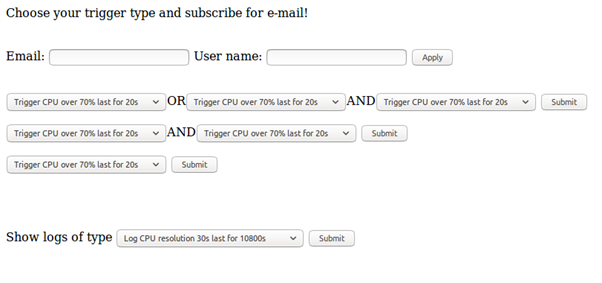

# ZPR_ResMonitor
Windows and linux resource monitor with smart logging and notifying options. 

Allows to define combination of admin's defined triggers (like RAM over 200MB last for 5s) in boolean predicates like `{(trig1 OR trig2) AND trig3}` or simpler. When some predicate is satisfied - an email is being sent to address specified by predicate creator (user).

Application provides HTTP server as interface.



Only admin can specify type of triggers and logging types. It is being done in specification file:

```
    trigger cpu over {70%, 80%, 90%} last for {20s, 1m}
    trigger cpu under {5%, 50%} last for {2s, 20s}
    trigger memory over 200MB last for 1s
    trigger memory over 75% last for 10s
    trigger disk over 9mb/s last for 1m2s

    log cpu for {3h, 6h, 12h} resolution {30s, 5m, 15m, 30m, 1h}
    log memory for {12h, 1d, 1d12h, 2d} resolution {1h, 6h}
    log memory for {2h, 8h} resolution {15s}
    trigger disk under 1MB/s last for 2s
    log disk for 72h resolution {1h}
    log disk for 72h resolution {2h}
    log disk for 72h resolution 3h
```

## Compilation
Code is fully portable between windows and linux. Requires `boost` library, `cmake` and `flex` (for optional lexer modification). Compiler have to implement C++14 standard (at least).

```bash
$ mkdir BUILD && cd BUILD
$ cmake ..
$ {make, msbuild} {monitor, testsmonitor}
```

## Used additional libraries

1. SMTP client (with slight modifications for wp's SMTP sever): [http://codingways.blogspot.com](http://codingways.blogspot.com/2012/08/send-email-in-c-smtp-client-in-c.html)
2. HTTP server: [Simple-Web-Server](https://github.com/eidheim/Simple-Web-Server)
3. Boost: logging, unit testing, filesystem and some structures (like circullar_buffer)
